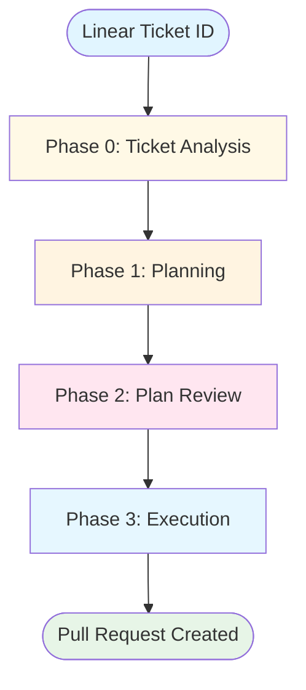
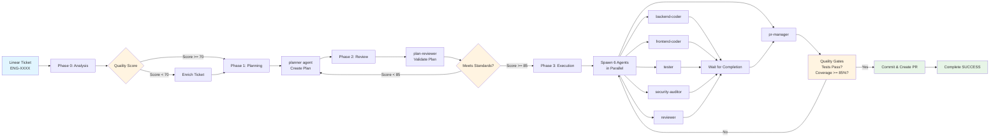
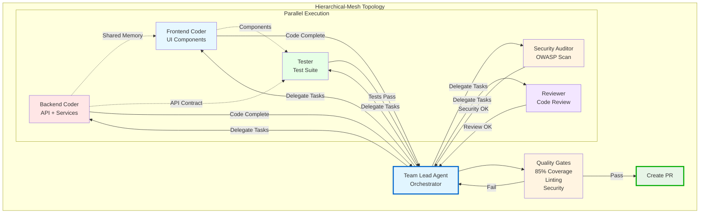

# Everstar Automated Ticket Execution

Autonomous ticket-to-PR workflow using Ruflo multi-agent orchestration.

## What This Does

Transforms Linear tickets into fully implemented, tested, and reviewed pull requests with minimal human intervention.

**Input:** Linear ticket ID (e.g., ENG-4590)
**Output:** Complete PR with implementation, tests, and quality gates passed

## Quick Start

### 1. Clone & Setup

```bash
# Clone the repo
git clone https://github.com/kevjand/everstar-swarms.git
cd everstar-swarms

# Make scripts executable
chmod +x scripts/*.sh

# Run automated setup
./scripts/setup.sh
```

**What you need:**
- GitHub account with Everstar access
- Linear API key from https://linear.app/settings/api
- Everstar repository cloned locally

The setup script will:
- OK Check prerequisites (Claude CLI, GitHub CLI, npm)
- OK Walk you through `gh auth login` (opens browser)
- OK Ask for your Linear API key (paste from Linear settings)
- OK Configure everstar repository path
- OK Test all integrations

**Optional:** Copy `.env.example` to `.env` for custom configuration

### 2. Run Automation

```bash
./scripts/everstar-cli.sh ENG-XXXX
```

Or with URL:
```bash
./scripts/everstar-cli.sh https://linear.app/everstar/issue/ENG-XXXX
```

### 3. What Happens Automatically

**Phase 0: Ticket Analysis & Enrichment**
- Fetches ticket from Linear via MCP
- Scores quality across 6 dimensions (0-100 points)
- If score < 70: generates acceptance criteria, edge cases, test scenarios
- Outputs enriched ticket to `/tmp/ruflo-ticket-enriched-ENG-XXXX.md`

**Phase 1: Planning**
- Spawns planner agent in hierarchical swarm
- Creates implementation plan following CLAUDE.md standards
- Outputs plan to `/tmp/ruflo-plan-ENG-XXXX.md`

**Phase 2: Automated Plan Review**
- Spawns plan-reviewer agent
- Validates against ticket-bot-standards.md
- Checks for edge cases, test coverage, security considerations
- Auto-approves if standards met (score >= 85%)

**Phase 3: Parallel Execution**
- Spawns 6 agents concurrently:
  - Backend Coder: API implementation
  - Frontend Coder: UI components
  - Tester: Test suite (85%+ coverage)
  - Security Auditor: Security scan
  - Reviewer: Code review
- Runs quality gates: linting, tests, security scan
- Creates commit and pushes branch
- Opens PR with detailed description

## Architecture

### Overview



### 4-Phase Workflow



### Ticket Quality Scoring (Phase 0)

| Dimension | Points | What It Checks |
|-----------|--------|----------------|
| Acceptance Criteria | 25 | Explicit Given-When-Then format |
| Edge Cases | 20 | Boundaries, errors, concurrency, performance |
| Test Requirements | 20 | Unit, integration, e2e scenarios specified |
| Prerequisites | 15 | Dependencies, migrations, services |
| Security | 10 | Auth, validation, data exposure, rate limits |
| Technical Details | 10 | Components, APIs, data models, UI/UX |

**Total: 100 points**
**Threshold: < 70 triggers enrichment**

### Multi-Agent Roles

| Agent | Role | Tools |
|-------|------|-------|
| ticket-analyzer | Scores ticket quality, generates enrichments | Linear MCP, memory |
| planner | Creates implementation plan | SPARC, architecture patterns |
| plan-reviewer | Validates plan against standards | ticket-bot-standards.md |
| coder (backend) | Implements API, services, models | TDD, type safety |
| coder (frontend) | Implements UI components | React, TypeScript |
| tester | Writes test suite (85%+ coverage) | Jest, Playwright |
| security-auditor | Security scan and validation | OWASP, input validation |
| reviewer | Code review before PR | Best practices, CLAUDE.md |

### Agent Coordination (Phase 3)



**Key Features:**
- **Hierarchical:** Team lead coordinates all agents
- **Mesh:** Agents share memory and communicate peer-to-peer
- **Parallel:** All agents execute simultaneously
- **Quality Gates:** Automatic validation before PR creation

## Quality Standards

All implementations must meet:

- **Test Coverage:** 85%+ minimum
- **Code Style:** No emojis, boolean prefixes (is_, should_, has_)
- **Commit Format:** `feat: add feature` (lowercase, no scope)
- **PR Format:** `ENG-4590: Add feature` (uppercase ticket)
- **Security:** Input validation at boundaries, no secrets
- **TDD:** Tests written before implementation

See [.claude/ticket-bot-standards.md](.claude/ticket-bot-standards.md) for complete standards.

## Repository Structure

```
swarm-exp/
├── scripts/
│   ├── everstar-cli.sh      # Main automation (4-phase workflow)
│   ├── setup.sh             # Team onboarding
│   └── cleanup.sh           # Maintenance (branches, tmp, swarm)
├── .claude/
│   ├── settings.json        # Hooks configuration
│   └── ticket-bot-standards.md  # Quality standards
├── docs/
│   └── ticket-enrichment-research.md  # Phase 0 research
├── CLAUDE.md               # Project configuration
└── README.md              # This file
```

## Common Commands

```bash
# Run automation on ticket
./scripts/everstar-cli.sh ENG-XXXX

# Clean up old branches
./scripts/cleanup.sh --branches

# Clean up temporary files
./scripts/cleanup.sh --tmp

# Reset swarm state
./scripts/cleanup.sh --swarm

# Archive merged branches
./scripts/cleanup.sh --archive

# Full cleanup (all of above)
./scripts/cleanup.sh --all

# Check status
./scripts/cleanup.sh --status
```

## Troubleshooting

### Linear MCP Not Working

```bash
# Verify Linear MCP configured
grep "@hatcloud/linear-mcp" ~/.claude.json

# Test Linear API directly
curl -H "Authorization: YOUR_KEY" \
  -H "Content-Type: application/json" \
  -d '{"query":"query { viewer { name } }"}' \
  https://api.linear.app/graphql

# Reconfigure if needed
./scripts/setup.sh
```

### GitHub Auth Issues

```bash
# Check auth status
gh auth status

# Reauth if needed
gh auth login
```

### Swarm Not Starting

```bash
# Check swarm status
cd /Users/kevinandrade/Desktop/everstar/everstar
npx @claude-flow/cli@latest swarm status

# Reset if needed
npx @claude-flow/cli@latest swarm shutdown
./scripts/cleanup.sh --swarm
```

### Quality Gates Failing

Check output in `/tmp/ruflo-execution-ENG-XXXX.md` for:
- Test coverage < 85%
- Linting errors
- Security scan failures
- Standards violations

### Worktree Already Exists

```bash
# Clean up old worktree
cd $EVERSTAR_REPO
git worktree remove /tmp/everstar-worktrees/kevjand/ENG-XXXX --force

# Or prune all deleted worktrees
git worktree prune
```

### Claude CLI Not Found

```bash
# Install Claude CLI
npm install -g @anthropic-ai/claude-code

# Or use Homebrew
brew install claude-ai/tap/claude
```

### Repository Not Found

Set EVERSTAR_REPO if auto-detection fails:

```bash
# Add to ~/.zshrc or ~/.bashrc
export EVERSTAR_REPO="/path/to/everstar/repo"
source ~/.zshrc
```

## Configuration

### Environment Variables

Copy `.env.example` to `.env` and configure:

```bash
cp .env.example .env
```

| Variable | Required | Description | Default |
|----------|----------|-------------|---------|
| `LINEAR_API_KEY` | Yes | Linear API key from https://linear.app/settings/api | - |
| `EVERSTAR_REPO` | No | Path to everstar repository | Auto-detected |
| `USER_PREFIX` | No | Default branch prefix (e.g., `kevjand`) | Prompts if not set |

**Auto-detection paths for EVERSTAR_REPO:**
- `$HOME/everstar/everstar`
- `$HOME/Desktop/everstar/everstar`
- `$HOME/workspace/everstar`

### Swarm Topology

Default: hierarchical-mesh with max 15 agents

To adjust (in everstar-cli.sh):
```bash
npx @claude-flow/cli@latest swarm init \
  --topology hierarchical \
  --max-agents 8 \
  --strategy specialized
```

## Documentation

- [Ticket Enrichment Research](docs/ticket-enrichment-research.md) - Phase 0 design and scoring framework
- [Recommended Improvements](docs/recommended-improvements.md) - Future enhancements
- [Ticket Bot Standards](.claude/ticket-bot-standards.md) - Code quality gates
- [CLAUDE.md](CLAUDE.md) - Project configuration and behavioral rules
- [Claude Flow Docs](https://github.com/ruvnet/claude-flow) - Multi-agent framework

## Support

- **Setup Issues:** Re-run `./scripts/setup.sh` and follow prompts
- **Automation Issues:** Check `/tmp/ruflo-*.md` output files for agent logs
- **GitHub Issues:** Report bugs at [everstar-swarms/issues](https://github.com/kevjand/everstar-swarms/issues)

## Prerequisites

Before running setup, install these:

- **Node.js:** `brew install node`
- **Claude CLI:** `npm install -g @anthropic-ai/claude-code`
- **GitHub CLI:** `brew install gh`

During setup, you'll need:

- **GitHub Account:** With access to Everstar repository
- **Linear API Key:** Get from https://linear.app/settings/api
- **Everstar Repo:** Clone to local machine

The setup script (`./scripts/setup.sh`) verifies everything and guides you through authentication.

---

**Ready to start?** Run `./scripts/setup.sh` to configure your environment, then `./scripts/everstar-cli.sh ENG-XXXX` to execute your first automated ticket!
